# Product Wizard Pipeline Flow Definition

## Overview

This document defines the complete end-to-end flow of the Product Wizard pipeline, from raw conversation transcripts through discovery, specification, refinement, and deployment. The pipeline is designed as a universal system that can handle any product development initiative while maintaining consistency and quality.

## Pipeline Architecture

### High-Level Flow Diagram

```
┌─────────────────────────────────────────────────────────────────┐
│                        DISCOVERY PHASE                          │
├─────────────────────────────────────────────────────────────────┤
│  Raw Input → Processing → Extraction → Structuring → Discovery │
│  Documents → Validation → Approval → Handoff to Specification  │
└─────────────────────┬───────────────────────────────────────────┘
                      │
┌─────────────────────────────────────────────────────────────────┐
│                     SPECIFICATION PHASE                        │
├─────────────────────────────────────────────────────────────────┤
│  Discovery Docs → Constitution → /specify → /clarify → /plan  │
│  → /tasks → Validation → Spec Kit Artifacts → Handoff to      │
│  Refinement                                                     │
└─────────────────────┬───────────────────────────────────────────┘
                      │
┌─────────────────────────────────────────────────────────────────┐
│                      REFINEMENT PHASE                          │
├─────────────────────────────────────────────────────────────────┤
│  Spec Kit Output → QA Planning → Testing → Security → Docs    │
│  → Deployment Config → Environment Setup → Validation →       │
│  Production Ready Artifacts → Handoff to Deployment           │
└─────────────────────┬───────────────────────────────────────────┘
                      │
┌─────────────────────────────────────────────────────────────────┐
│                      DEPLOYMENT PHASE                          │
├─────────────────────────────────────────────────────────────────┤
│  Production Artifacts → Version Control → Deployment →        │
│  Monitoring Setup → Release Management → Post-Deployment      │
│  Validation → User Feedback Loop → Learning Integration       │
└─────────────────────────────────────────────────────────────────┘
```

## Detailed Phase Definitions

### Phase 1: Discovery (Dream → Structured Ideas)

#### Input Sources
- **Audio/Video Recordings**: Meeting recordings, calls, presentations
- **Text Documents**: Chat logs, notes, emails, requirements documents
- **Digital Artifacts**: Screenshots, mockups, existing system documentation
- **Research Materials**: Market research, competitor analysis, user research

#### Processing Pipeline

##### Step 1.1: Ingestion and Validation
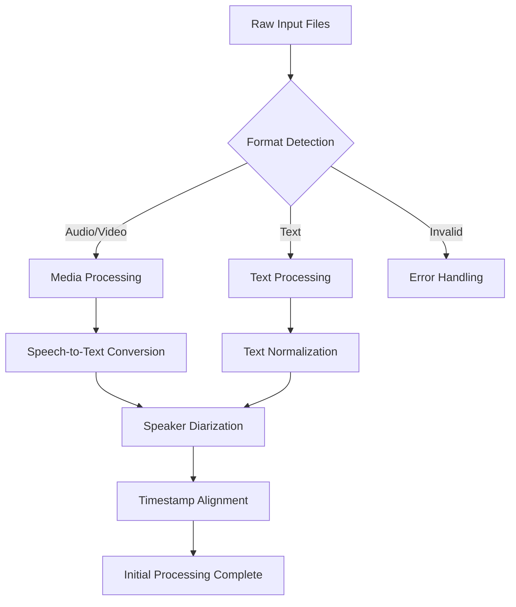

##### Step 1.2: Content Analysis and Extraction
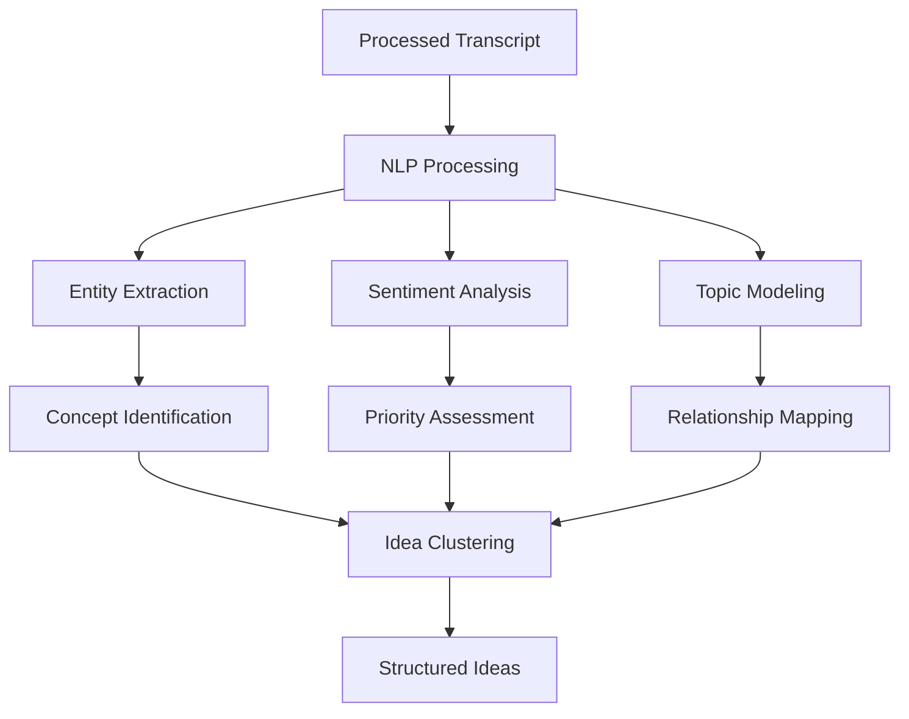

##### Step 1.3: Document Generation and Validation
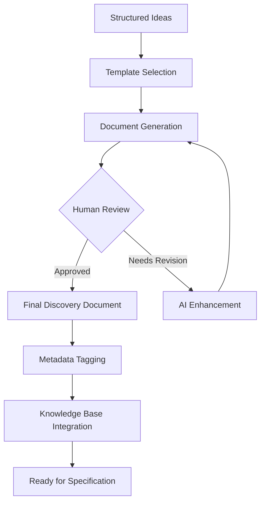

#### Discovery Phase Outputs
1. **Discovery Documents**: Structured summaries of key ideas and requirements
2. **Idea Catalogs**: Organized collections of concepts and features
3. **Priority Assessments**: Business and technical prioritization frameworks
4. **Context Documentation**: Supporting research and constraint documentation
5. **Validation Reports**: Quality assurance and completeness assessments

#### Quality Gates for Discovery
- **Completeness Check**: All major discussion points captured
- **Clarity Assessment**: Requirements clearly articulated
- **Feasibility Review**: Technical and business viability confirmed
- **Stakeholder Alignment**: Key participants have reviewed and approved

### Phase 2: Specification (Ideas → Spec Kit Integration)

#### Integration with Existing Spec Kit Workflow

##### Step 2.1: Constitution and Project Setup
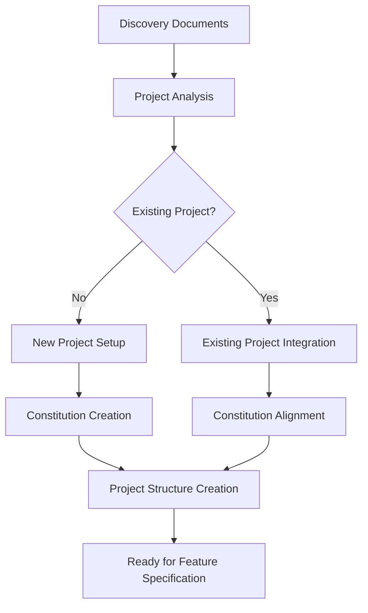

##### Step 2.2: Feature Specification Process
```mermaid
graph TD
    A[Discovery Requirements] --> B[/specify Command]
    B --> C[Feature Branch Creation]
    C --> D[Specification Template]
    D --> E[AI-Powered Specification]

    E --> F[Initial Spec Document]
    F --> G[/clarify Command]
    G --> H[Requirements Clarification]

    H --> I[Clarified Specification]
    I --> J[Review and Validation]

    J --> K{Specification Approved?}
    K -->|Yes| L[Ready for Planning]
    K -->|No| M[Iterative Refinement]
    M --> E
```

##### Step 2.3: Technical Planning and Task Generation
```mermaid
graph TD
    A[Approved Specification] --> B[/plan Command]
    B --> C[Technical Architecture]
    C --> D[Implementation Details]
    D --> E[Research Integration]

    E --> F[Complete Plan Document]
    F --> G[/tasks Command]
    G --> H[Task Breakdown]
    H --> I[Dependency Mapping]

    I --> J[Executable Task List]
    J --> K[Plan Validation]

    K --> L{Plan Approved?}
    L -->|Yes| M[Ready for Refinement]
    L -->|No| N[Plan Iteration]
    N --> B
```

#### Specification Phase Outputs
1. **Project Constitution**: Governing principles and development guidelines
2. **Feature Specifications**: Detailed requirement documents per feature
3. **Technical Plans**: Implementation architecture and approach
4. **Task Lists**: Executable development tasks with dependencies
5. **Research Documents**: Supporting technical research and decisions

#### Quality Gates for Specification
- **Constitutional Compliance**: All specs align with project principles
- **Technical Feasibility**: Implementation approach is sound and achievable
- **Requirement Clarity**: All requirements are unambiguous and testable
- **Cross-Feature Consistency**: Specifications work together cohesively

### Phase 3: Refinement (Spec Kit → Production Ready)

#### Production Preparation Pipeline

##### Step 3.1: Quality Assurance Integration
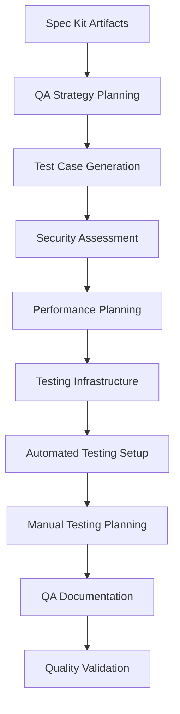

##### Step 3.2: Documentation and Deployment Preparation
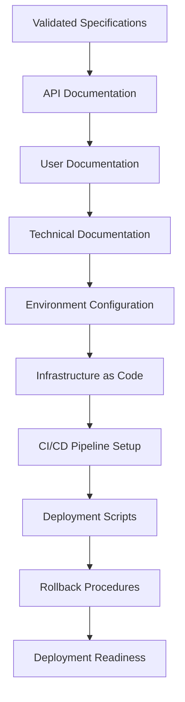

##### Step 3.3: Compliance and Security Validation
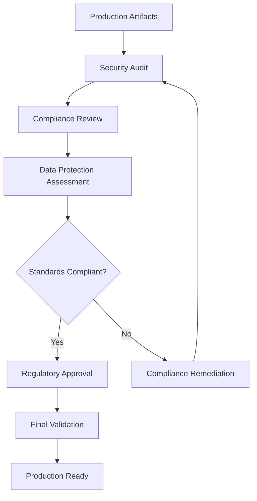

#### Refinement Phase Outputs
1. **Quality Assurance Suite**: Comprehensive test coverage and validation
2. **Documentation Package**: Complete user and technical documentation
3. **Deployment Configuration**: Infrastructure and pipeline definitions
4. **Security and Compliance Reports**: Audit trails and compliance evidence
5. **Production Readiness Assessment**: Final validation and approval

#### Quality Gates for Refinement
- **Test Coverage**: All critical paths tested with appropriate coverage
- **Security Validation**: No high-severity vulnerabilities remain
- **Documentation Completeness**: All user and technical documentation complete
- **Deployment Readiness**: All environments configured and validated

### Phase 4: Deployment (Production → Release Management)

#### Release Management Pipeline

##### Step 4.1: Version Control and Release Preparation
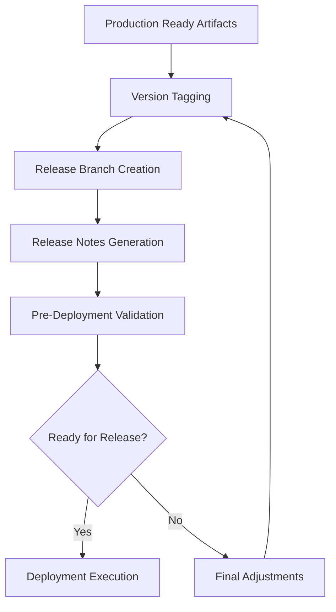

##### Step 4.2: Deployment and Monitoring Setup
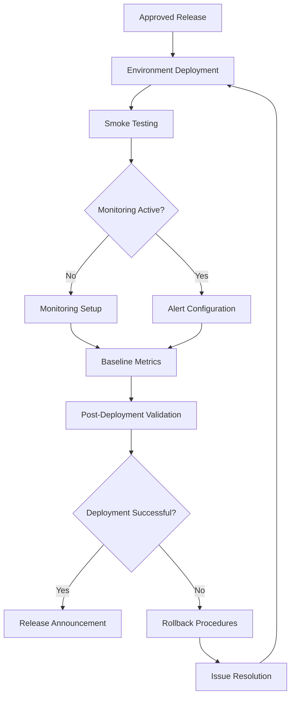

##### Step 4.3: Post-Release Learning and Feedback
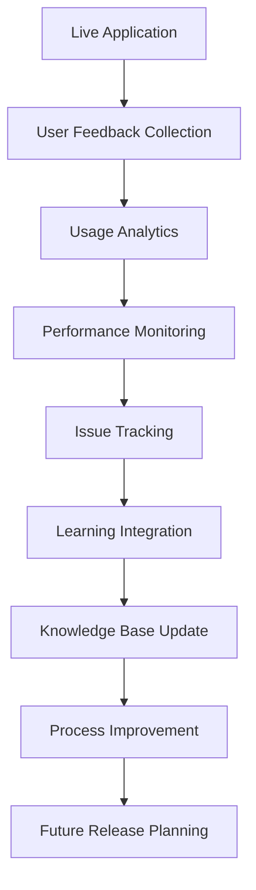

#### Deployment Phase Outputs
1. **Released Software**: Live application in production environment
2. **Monitoring Dashboard**: Real-time performance and usage tracking
3. **Release Documentation**: Version history and deployment records
4. **Feedback Systems**: User input collection and analysis mechanisms
5. **Learning Documentation**: Insights and improvements for future releases

#### Quality Gates for Deployment
- **Deployment Success**: Application starts and basic functionality verified
- **Monitoring Active**: All monitoring systems operational and capturing data
- **User Access**: Target users can access and use the application
- **Rollback Ready**: Rollback procedures tested and available if needed

## Cross-Phase Integration Points

### Knowledge Flow
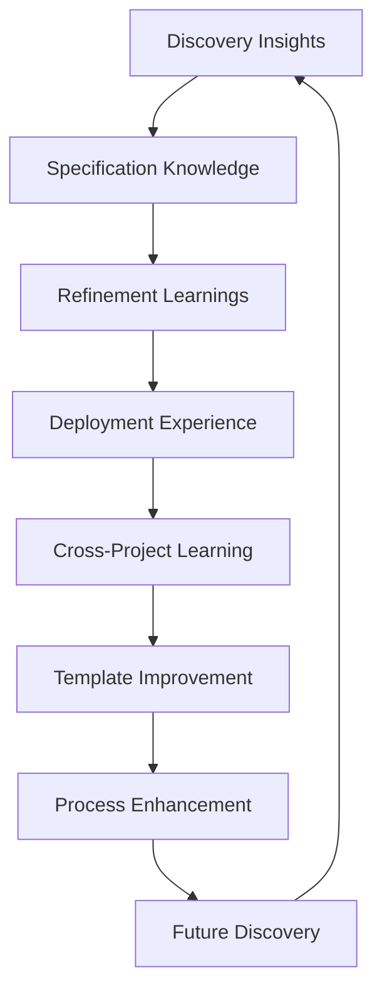

### Data Consistency
- **Unique Identifiers**: Consistent ID schemes across all phases
- **Metadata Standards**: Common metadata format for all artifacts
- **Version Control**: Linked versioning across all pipeline outputs
- **Traceability**: Full traceability from transcript to deployed feature

### Quality Assurance
- **Validation Pipelines**: Automated quality checks at each phase boundary
- **Cross-Reference Validation**: Ensure consistency across related documents
- **Dependency Tracking**: Track dependencies between phases and artifacts
- **Regression Prevention**: Prevent quality degradation as pipeline progresses

## Pipeline Orchestration

### Workflow Management
- **State Tracking**: Monitor progress through each phase
- **Dependency Management**: Handle complex dependencies between tasks
- **Parallel Processing**: Execute independent tasks concurrently
- **Error Handling**: Graceful failure recovery and retry mechanisms

### Human-in-the-Loop Integration
- **Review Points**: Strategic points requiring human validation
- **Approval Workflows**: Structured approval processes for critical decisions
- **Feedback Loops**: Mechanisms for continuous process improvement
- **Override Capabilities**: Allow human intervention when needed

### Automation Levels
- **Level 1 (Manual)**: Human-driven with AI assistance
- **Level 2 (Semi-Automated)**: AI executes with human oversight
- **Level 3 (Automated)**: AI executes with exception-based human intervention
- **Level 4 (Autonomous)**: Full AI orchestration with human governance

## Success Metrics and Monitoring

### Pipeline Health Metrics
- **Throughput**: Items processed per unit time at each phase
- **Latency**: Time from input to completion for end-to-end flow
- **Error Rates**: Processing failures and recovery success rates
- **Quality Scores**: Assessment of output quality at each phase

### Business Impact Metrics
- **Time to Market**: Reduction in time from idea to deployment
- **Development Efficiency**: Reduction in rework and redundant work
- **Product Quality**: Improvement in delivered product quality
- **Team Productivity**: Enhancement in team output and satisfaction

### Continuous Improvement
- **Performance Tracking**: Monitor all metrics continuously
- **Root Cause Analysis**: Investigate failures and quality issues
- **Process Optimization**: Implement improvements based on data
- **Learning Integration**: Incorporate lessons into future iterations

## Universal Application Framework

### Industry Adaptation
- **Healthcare**: HIPAA compliance, medical device regulations
- **Finance**: Security standards, audit requirements, regulatory compliance
- **E-commerce**: Performance requirements, payment processing, inventory management
- **SaaS**: Multi-tenancy, scalability, API-first design

### Team Size Adaptation
- **Solo Developer**: Streamlined process with minimal oversight
- **Small Team**: Collaborative workflow with peer review
- **Large Team**: Structured governance with formal approvals
- **Enterprise**: Compliance frameworks and organizational integration

### Project Type Adaptation
- **Greenfield Projects**: Full pipeline execution from scratch
- **Legacy Modernization**: Integration with existing systems and processes
- **MVP Development**: Accelerated path with focus on core features
- **Feature Enhancement**: Targeted refinement of existing capabilities

This comprehensive pipeline flow definition ensures that Product Wizard can handle any product development scenario while maintaining quality, consistency, and efficiency across all phases from discovery to deployment.
